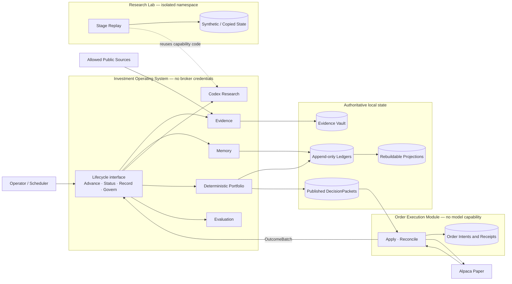
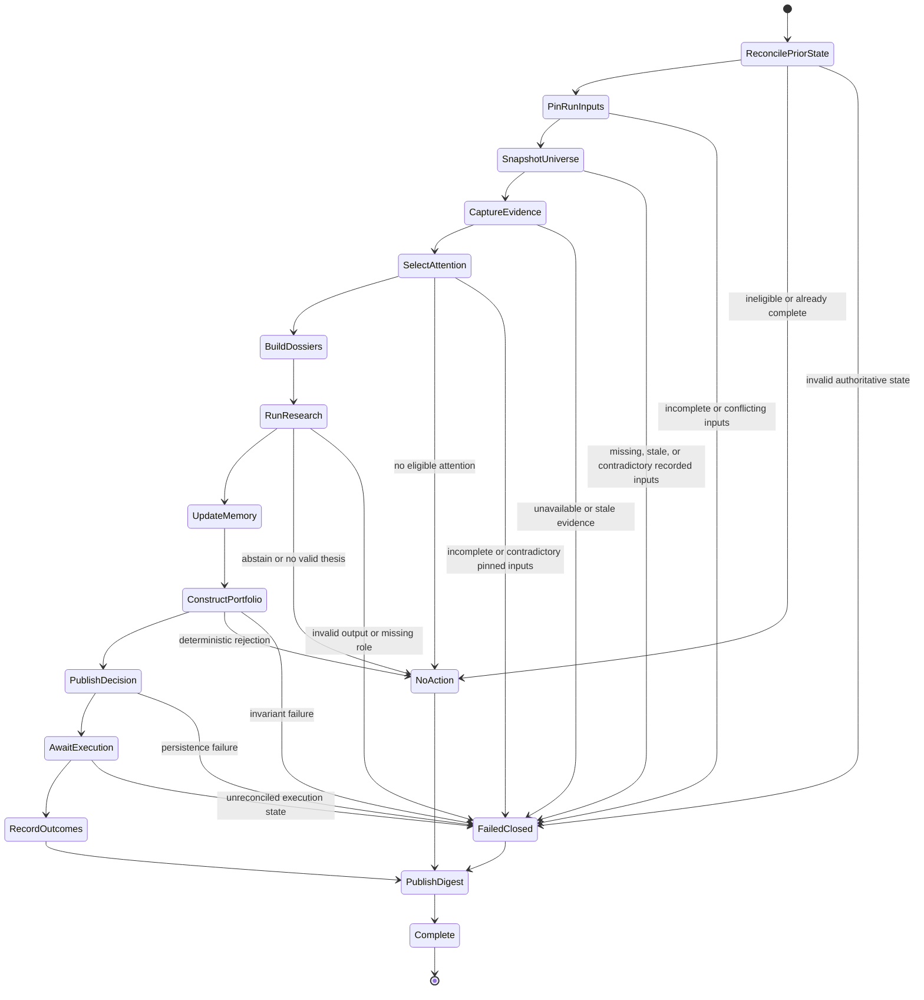
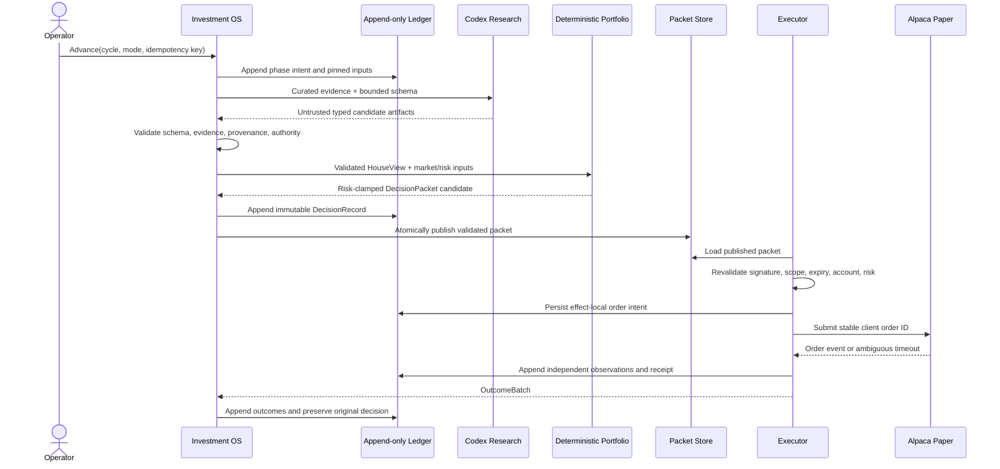

# Architecture

This document is the source of truth for the accepted system architecture: runtime shape, module
seams, authority, lifecycle, durable state, and trust boundaries. It describes the architecture that
implementation must preserve even while the repository is still a scaffold. The README states
implementation status.

Architecture does not own investment rules, product outcomes, Python import edges, runtime values,
test procedure, or design rationale. Those live in `investment-domain.md`,
`product-requirements.md`, `module-graph.md`, `config-catalog.md`, `testing.md`, and ADRs respectively.

## Design drivers

- Keep a local Python 3.12 modular monolith until measured constraints justify another deployment
  shape.
- Expose deep lifecycle interfaces while keeping research stages, persistence, and provider mechanics
  internal.
- Make evidence, beliefs, decisions, and outcomes append-only and reconstructable as of their original
  cutoffs.
- Keep model research outside deterministic portfolio, risk, and broker authority.
- Persist intent before external effects and make every effect independently idempotent.
- Fail closed with a durable disposition when required state is stale, incomplete, contradictory, or
  invalid.
- Enforce safety-critical invariants at the earliest stable layer instead of relying only on prose
  or review convention.

## Multi-asset extension constraint

[PR-CON-006](product-requirements.md#operational-constraints) and
[ADR 0005](adr/0005-share-core-contracts-with-typed-asset-variants.md) establish one deterministic
core with closed asset-class-owned variants. The target vocabulary distinguishes `us_equity`,
`crypto_spot`, and `listed_option`; V0 composition enables only `us_equity`. Describing the other
variants does not authorize their research, portfolio, risk, market-data, or execution behavior.

The official-provider facts behind this design are traced in the non-authoritative
[Alpaca capability matrix](research/alpaca-multi-asset-capabilities.md). Provider documentation and
responses are boundary input. This document and the ADR own the accepted architecture.

Names are fixed across the public and durable contracts: Decision Cycle is the domain concept,
`DecisionCycleIdentity` is its closed identity union, `MarketSession` is the equity variant and current
kernel input, and `CryptoDecisionWindow` is a reserved future variant. Option expiration, exercise,
and assignment are due reconciliation obligations rather than another cycle identity.

### Instrument identity

Every durable instrument reference uses a versioned `InstrumentIdentity` discriminated union. Its
common envelope carries an asset-class discriminator plus a validated provider-and-environment
catalog namespace and opaque catalog identifier. The identifier is interpreted only by the adapter
for that namespace. A display symbol, name, or provider enum is alias provenance and never a join key,
idempotency input, or durable foreign key.

The variants carry only identity-defining semantics for their asset class:

- `EquityInstrumentIdentity` carries the listing venue. Eligibility facts such as status,
  tradability, and fractionability belong to the observed instrument record rather than its identity.
- `CryptoSpotInstrumentIdentity` carries base currency, quote currency, and execution venue. Pair
  spellings such as `BTC/USD` and `BTCUSD` are aliases of a resolved identity, not interchangeable
  keys.
- `ListedOptionInstrumentIdentity` carries its underlying `EquityInstrumentIdentity`, expiration,
  call or put right, exercise style, strike amount and currency, and a terms version covering the
  multiplier and deliverable. The option display symbol cannot substitute for the contract identity
  or underlying relationship. Alpaca's current official surface also contains index-option evidence;
  an index or unknown underlying is unsupported by this identity variant and fails closed until a
  separately approved underlying and schedule variant exists.

An adapter may retain the source identifier and aliases in provenance, but it must validate their
one-to-one mapping at the pinned cutoff before constructing an identity. Missing, reused, or
contradictory mappings fail closed; a symbol change never creates a new identity by itself.

### Shared core and variant ownership

The shared core owns invariants that have the same meaning for every asset class. A capability owns a
closed variant where the provider facts change the meaning or allowed state.

| Concept | Shared deterministic core | Asset-class-owned variant |
| --- | --- | --- |
| Instrument identity | Versioned discriminator, canonical identity bytes, hashes, alias provenance, and referential integrity | Equity listing identity; crypto base/quote pair and venue; option contract with a supported equity underlying, expiration, strike, style, multiplier, and deliverable terms |
| Market data | Evidence cutoff, availability time, source identity, entitlement, Data Regime, content hash, and staleness disposition | Feed selection, venue codes, message parser, session coverage, and class-specific quote, trade, bar, chain, or order-book payload |
| Trading clock and lifecycle | `DecisionCycleIdentity`, pinned cutoff, public disposition and liveness semantics, and due-obligation envelope | NYSE-relative `MarketSession` and its phase policy; a future UTC `CryptoDecisionWindow` and its own phase policy; supported option expiration or late-close obligations |
| Quantity, currency, and multiplier | Exact decimal representation with explicit unit and currency; no binary-float or implicit conversion | Whole or fractional shares, base or quote crypto quantities and increments, and whole option contracts with explicit multiplier and deliverable |
| Positions | Versioned snapshot envelope, instrument reference, observed and available times, signed quantity, valuation provenance, and snapshot hash | Share, coin, pair, or contract quantity semantics and any underlying or settlement relationship |
| Orders and time-in-force | Packet identity, immutable intent, deterministic risk approval, expiry, canonical-instrument effect key, and receipt reconstruction | Allowed order shapes, quantity form, price fields, session eligibility, time-in-force, and cancel or replace policy |
| Exercise, assignment, and expiration | Append-only broker-activity envelope, independent observations, idempotent activity identity, and reconciliation completion | Option exercise request, assignment, expiration, cash settlement, contract removal, and underlying-position effects |
| Fills and reconciliation | Intent-before-effect, stable client identity, independent order and activity observations, typed receipts, and rebuildable outcomes | Provider status mapping, fee treatment, fill units, multi-leg grouping, and class-specific position or cash effects |

Alpaca enum values, endpoint defaults, error codes, and response objects remain in `adapters`. Adapters
map them into owner-defined variants and record the provider contract version in the Data Regime.
When official sources disagree about a supported value, the adapter capability profile treats the
combination as unsupported until recorded contract evidence resolves it; the core never widens an
enum by inference.

Entitlement, status, and buying-power facts in the capability matrix are boundary observations for
the operator's own Trading API connection, not shared-core or asset-domain models. An adapter may
validate those raw facts into an existing typed refusal path, but they never activate an asset class
or create durable account, customer, or multi-account state. Closed configuration is the sole source
of enabled capability authority.

### Asset-neutral durable contracts

Every shared snapshot, packet, receipt, and durable event has a common versioned envelope containing
its record kind, envelope schema version, payload discriminator and payload schema version, canonical
subject or cycle identity where applicable, relevant event and availability times, Data Regime,
authority scope, material configuration and source fingerprints, and content hash. Asset payloads are
closed variants validated on write and read. A flat record with unrelated nullable equity, crypto,
and option fields is invalid.

- Universe, position, and evidence snapshots use the same immutable envelope and canonical hashing
  rules. Their variant payloads state exact units and never infer an asset class from a symbol.
- `DecisionPacket` integrity, signature, authority scope, expiry, and deterministic risk approval
  remain shared. An eventual packet payload is exactly one validated equity, crypto-spot, or
  listed-option intent variant; the executor cannot reinterpret one variant as another.
- Execution receipts and broker activities preserve order observations, fills, fees, exercise,
  assignment, expiration, and position effects as independent facts. A delayed activity and an
  already changed position may coexist without either being manufactured from the other.
- Effect idempotency derives from the packet, canonical instrument identity, effect kind, and attempt,
  never from a display symbol. Reconciliation keys provider observations by their stable source
  identity and appends corrections rather than overwriting them.

Unknown discriminators, unsupported schema versions, disabled classes, malformed variant payloads,
stale observations, incompatible capability profiles, or unresolved identity mappings fail closed at
the first seam. A trustworthy request key receives a bounded durable refusal. Configuration that
attempts to enable an unsupported class is refused before runtime state or capability composition.

### Composition and extension budget

The V0 entrypoint statically composes only the equity variants and requires the enabled asset-class
set to equal `{us_equity}`. Observed Alpaca entitlements cannot widen that set. Crypto or option
configuration is rejected before `Advance` is constructed; a disabled variant arriving through a
recorded or broker boundary is refused before research, portfolio construction, packet publication,
or broker effects. A disabled-class holding is never silently dropped: it remains an explicit
portfolio mismatch that blocks discretionary progress until an authorized capability can reconcile it.

Adding one asset class may add:

- one identity, cycle-plan, instrument, position, order-intent, and broker-activity variant;
- asset-owned eligibility, portfolio, risk, execution, and reconciliation policy;
- provider adapters and recorded contract fixtures for the new variant;
- complete, versioned configuration with an explicit activation gate; and
- unit, integration, contract, mutation-critical, and explicitly authorized live-rehearsal evidence.

A new asset lifecycle owns its phase and checkpoint sequence. It must not alter the existing
MarketSession phase order or require rewriting the public lifecycle results, common durable envelope,
provenance and snapshot hashing, receipt reconstruction, packet-integrity checks, effect-idempotency
rules, append-only correction behavior, or process authority separation. A demonstrated exception
updates this document and receives an ADR before implementation. There is no dynamic plugin registry
or runtime discovery path; composition and every closed union remain explicit and exhaustively
checked. Later activation must also remain within PR-CON-001's existing-entitlement and
no-metered-fallback constraint; this extension design adds no service dependency.

## Temporal semantics

[ADR 0006](adr/0006-separate-absolute-instants-from-market-time.md) separates the shared timeline from
asset-owned calendar meaning. Every Absolute Instant crossing deterministic code, a durable boundary,
a process or model boundary, or machine telemetry is normalized to UTC at microsecond precision. Its
canonical durable text is fixed-width ISO 8601 with the `+00:00` offset. Equivalent aware inputs
therefore have one value for comparison, ordering, hashing, replay, and reconstruction. Naive,
over-precise, malformed, or noncanonical durable values fail closed at their owning seam.

A `MarketSession` remains an NYSE trading date, not a midnight instant. US-equity schedule policy uses
the NYSE calendar and `America/New_York` to interpret exchange-relative rules, including holidays,
early closes, and daylight-saving changes, then resolves a deadline or cutoff to an Absolute Instant.
Provider timestamp spelling remains raw provenance only when material; it never replaces the
normalized instant. Operator trading views may derive Eastern Time, but host-local or displayed time
is not authoritative state. Timeouts and latency use monotonic elapsed time rather than wall-clock
arithmetic. These invariants are fixed architecture, not runtime timezone configuration.

## Executable invariants

Rules that protect investment authority, determinism, provenance, append-only durability, or process
isolation must have stable, proportionate mechanical enforcement when one can express the contract
without weakening or duplicating its owner. Apply the earliest layer that can prove the rule:

1. types and constructors make invalid internal states difficult to represent and exhaust closed
   state;
2. module structure prevents forbidden dependencies and authority from becoming reachable;
3. validation at a seam refuses hostile or untrusted representations before typed construction and
   before handoff to another authority domain;
4. deterministic tests exercise observable and temporal invariants that the earlier layers cannot
   prove; and
5. human review judges semantics, proportionality, and cases that cannot be encoded reliably.

The [module graph](module-graph.md) owns executable Python dependency direction, while the
[testing policy](testing.md) owns behavioral evidence and gate selection. A passing mechanical check
is supporting evidence, not proof that the owning semantic contract is complete or correct. Do not
add brittle checks merely to mechanize prose, and do not let a changed review or publication gate
approve itself.

### Capability effect boundaries

[ADR 0007](adr/0007-enforce-bounded-capability-effects.md) makes concrete effect dependencies
mechanically visible at the production capability boundary. Every Python source under
`src/agentic_investment_os/` is protected by default except `adapters/` and `entrypoints/`, which own
external effects and composition. Protected capabilities receive typed values or owner-defined ports;
they do not obtain wall-clock time, ambient randomness or identifiers, host environment or local-time
state, network or model access, broker authority, database access, filesystem effects, or process
control directly.

`make architecture` enforces this boundary with a fixed Ruff banned-API catalog and a small syntax
check for cases whose acceptability depends on an explicit argument or typed receiver. The contextual
check recognizes direct construction, annotations, and simple name or attribute aliases for `Path`,
`Random`, and `datetime`; it requires seeded local generators and explicit timezone conversion. Inline
lint suppression does not bypass the gate. Diagnostics identify a stable `CAP000`–`CAP010` category,
repository-relative location, and remediation without printing source content.

This is deliberately bounded static evidence. It does not infer arbitrary control flow, containers,
protocol implementations, reflection, dynamic imports, or interprocedural types, and it does not
claim exhaustive detection of evasive code. Extend the catalog or narrow contextual recognizer only
for a demonstrated, high-signal effect pattern with both denied and allowed fixtures. Adapters and
entrypoints remain subject to their authority contracts, module direction, behavioral tests, and
semantic review even though this particular gate exempts them.

## System topology



The three process seams are the Investment Operating System, Order Execution Module, and Research
Lab. They may share immutable domain contracts inside one package; they do not share authority or
credentials.

## Public lifecycle interfaces

Normal production callers see six capabilities:

- **Advance** resolves or resumes a `DecisionCycleIdentity`. V0 accepts only its `MarketSession`
  variant; its common versioned receipt envelope contains the disposition, a versioned
  `LifecycleCheckpoint` whose discriminator selects the equity phase, exact cycle and pinned inputs,
  eligible-universe snapshot identifier, evidence references, bounded Attention Artifact or typed
  attention refusal, fail-closed reason, and whether the call advanced fresh work, resumed committed
  progress, or replayed prior completion. A successful receipt's relevant
  and availability times identify when that call's result was recorded; the Evidence Cutoff remains
  a separate pinned input. A recognized disabled cycle or malformed cycle is returned as a bounded
  refusal before the clock, adapter, or authoritative lifecycle ledger is entered. A valid
  `MarketSession` remains explicit in any later durable refusal and its replay.
- **Status** validates authoritative lifecycle history, replaces its disposable projection, and returns
  the active `LifecycleCheckpoint`, `last_completed_cycle` as a `DecisionCycleIdentity`, the latest
  eligible-universe checkpoint as an exact `universe_snapshot_cycle` and snapshot-identifier pair,
  pinned run identity, lifecycle liveness, and any available durable terminal reason. In V0 each
  exposed cycle is a `MarketSession` and the checkpoint payload is an equity phase; neither public
  result exposes a bare equity-only phase as the stable contract.
- **Record** appends due market, forecast, thesis, and execution observations without changing the
  original decision.
- **Govern** schedules a signed, operator-approved Constitution, champion, or controlled-policy
  change for a future Market Session boundary.
- **Apply** independently validates one published `DecisionPacket`, manages only its permitted paper
  orders, and returns an `ExecutionReceipt`.
- **Reconcile** observes broker orders and positions, matches stable client order identifiers, and
  returns an `OutcomeBatch` for `Record`.

Production entrypoints do not expose individual research stages. Stage replay belongs to the Research
Lab and can write only to its own namespace.

## Session lifecycle

The V0 operating system is a checkpointed state machine over append-only records. Each transition
persists intent before work and appends its observed result before advancing. Repeating a request
returns its prior disposition or resumes from the last safe checkpoint.

The implemented `domain.lifecycle` kernel remains specific to the `MarketSession` lifecycle under
[the active kernel decision](../.agents/notes/implemented/2026-08-22-keep-lifecycle-kernel-specific.md).
The application boundary validates `DecisionCycleIdentity` and unwraps only `MarketSession` before
invoking that kernel. The equity planner resolves the session, Evidence Cutoff, schedule provenance,
and due reconciliation obligations; the kernel never reads a calendar or switches on an asset-class
discriminator.

A separately authorized crypto implementation would first add a concrete `CryptoDecisionWindow`
planner and its own transition policy while conforming to the public lifecycle results, durable
envelope, and receipt contracts. Only that second implementation can justify extracting proven common
transition machinery. Closed composition dispatch occurs before a transition kernel, so neither
specific kernel accumulates asset-class branches. Option expiration, exercise, and assignment enter
the equity path through `Reconcile` as due broker activities rather than new MarketSession phases.

A framework-free lifecycle kernel reconstructs typed authoritative history and selects the next
event, refusal, conflict, or receipt. Application code repeats that operation until it receives a
terminal receipt. Persistence adapters validate hostile representations, invoke the kernel inside an
atomic transaction, and append only the selected typed record; they do not encode phase ordering or
recovery policy. [ADR 0002](adr/0002-lifecycle-policy-in-domain-kernel.md) records this ownership and
the request-scoped compatibility boundary.



`NoAction` is an expected, durable outcome. `FailedClosed` records why the cycle cannot safely
continue. Neither state publishes a new discretionary order. A later LangGraph adapter may replace
the transition implementation but must preserve this interface, state meaning, checkpoints, and
idempotency behavior.

A cycle whose due activities are missing, stale, contradictory, or not reconstructable also remains
failed closed. Its transition policy sees only whether the typed reconciliation obligation is
complete; asset-owned policy interprets the activity.

### Lifecycle walkthroughs

#### Equity daily cycle

The V0 scheduler resolves an NYSE trading date and exchange-relative deadlines into an equity
`MarketSession`. `ReconcilePriorState` proves cash, positions, pending orders, and prior receipts agree.
`PinRunInputs` records the equity cycle identity, equity-feed Data Regime and Evidence Cutoff,
configuration, instrument catalog, position snapshot, and policy fingerprints; the current Basic
entitlement uses IEX, while a later SIP entitlement is a different regime. `SnapshotUniverse`
publishes the eligible universe before `CaptureEvidence` appends intent-first market, news, SEC,
issuer, and official-macro capture outcomes to the Evidence Vault. `SelectAttention` derives only the
approved local features from that exact checkpoint, publishes bounded Candidate Cards and Dossier
requests, and records due-holding refreshes outside the new-Dossier cap. It consumes neither a model
nor an external adapter and cannot publish a Dossier, Thesis, portfolio weight, packet, or order. The
remaining phases run once and publish at most one Champion decision and packet for that cycle. A
non-equity activation
request or position is refused before evidence or research; an NYSE holiday produces the existing
durable no-action path rather than a synthetic session.

#### Crypto while US equities are closed

In a separately authorized future composition, a crypto planner can produce a UTC-bounded
`CryptoDecisionWindow` while the NYSE planner produces none. Its concrete transition policy must
own its phase and checkpoint sequence while conforming to the public lifecycle results, durable
envelope, receipt, packet-integrity, and reconciliation contracts. Crypto policy also owns 24/7
scheduling, base/quote quantities, venue data, order increments, time-in-force, and fee-currency
observations; composition dispatches before transition logic rather than adding an `if crypto` branch.
Under V0, the same activation attempt is a configuration refusal and creates no research, packet,
order, or broker effect.

#### Option expiration or assignment

In a separately authorized future composition, the option planner marks expiration obligations in
the cycle plan, while `Reconcile` independently consumes provider position snapshots and stable
exercise, assignment, expiration, and paired underlying-transaction activities. The option variant
links the contract identity to its underlying equity identity and applies the recorded multiplier and
deliverable. Reconciliation appends each observation once, updates no prior record, and exposes the
resulting option, the owner's underlying position, and cash state to the next cycle. A position change
observed before a delayed activity remains an unresolved independent fact and blocks discretionary
progress; the system neither invents the activity nor repeats an effect. The MarketSession transition
graph gains no option-specific branch. An option with an index or unknown underlying is also refused
rather than coerced into an equity identity. V0 refuses every option variant before this path is
reachable.

Lifecycle status is derived only from the append-only event, refusal, and conflict ledgers. Rebuilding
validates the complete authoritative history before atomically replacing the projection; missing or
malformed projection state is discarded, while malformed authoritative history fails closed. A
completed phase does not imply a completed Decision Cycle: `last_completed_cycle` advances only from
a durable `Complete` event. The separately named `universe_snapshot_cycle` advances atomically with
its exact snapshot identifier when `SnapshotUniverse` completes. Status liveness describes whether
the recorded lifecycle is not started, active, or failed closed; scheduler heartbeat and schedule
health are separate operational concerns.

## Safe execution handoff



Timeout and broker acceptance remain independent facts. Reconciliation resolves ambiguity by stable
client order identity; it never guesses or repeats exposure blindly.

## Module ownership

| Module | Owns | Interface presented to callers |
| --- | --- | --- |
| `domain` | Framework-free values, lifecycle transition policy, events, identifiers, and invariants | Immutable domain contracts and lifecycle decisions |
| `application` | Lifecycle use-case orchestration | `Advance`, `Status`, `Record`, `Govern` |
| `evidence` | Content-addressed artifacts, assertions, as-of provenance | Evidence capture and lookup |
| `memory` | Belief ledger, graph projection, decision journal | Append and as-of retrieval |
| `research` | Typed Codex roles and evidence-bound workflow | Validated research artifacts |
| `portfolio` | HouseView validation, sizing, limits, target bands, packets | Deterministic construction |
| `execution` | Packet verification, order policy, idempotency, reconciliation | `Apply`, `Reconcile` |
| `evaluation` | Outcome resolution, benchmarks, calibration, challengers | Evaluation records |
| `adapters` | SQLite, filesystem, clock, Codex, SEC, Alpaca implementations | Owner-defined ports |
| `entrypoints` | Process composition, configuration, paths, credentials | CLI and scheduler surfaces |

An interface lives with the module that owns its behavior. Adapters satisfy those interfaces;
entrypoints assemble them. `module-graph.md` owns allowed Python import directions and the distinction
between policy and executable edges.

## Eligible-universe compatibility contract

The following is the permanent contract for the first and every later eligible-universe
implementation. It must hold before evidence work can depend on eligible-universe records.

- **Instrument identity:** Replace symbol keys with the versioned `InstrumentIdentity` union and its
  equity, crypto-spot, and listed-option variants. Only `EquityInstrumentIdentity` is eligible in V0;
  the disabled variants preserve explicit portfolio mismatches. Aliases remain provenance, while
  deduplication, ordering, membership, retry, and hashes use canonical identity bytes. The Alpaca V0
  adapter accepts only the `alpaca-paper` provider-and-environment catalog namespace, including for an
  option's equity underlying. Every alias and provider catalog key maps to exactly one canonical
  identity across the complete snapshot; missing, reused, or contradictory mappings fail closed. An
  option whose underlying does not resolve to the supported equity identity is unsupported rather
  than eligible.
- **Universe snapshots:** Replace flat equity-shaped asset and symbol-only holding records with
  common versioned instrument and position snapshot envelopes containing exactly one discriminated
  payload, observed and available times, Data Regime, authority scope, source fingerprint, and content
  hash. Position variants carry a signed exact quantity, explicit unit, and valuation amount,
  currency, and source. Subjects reference canonical identity, new-entry eligibility remains distinct
  from holding refresh, and disabled-class holdings remain explicit portfolio mismatches.
- **Lifecycle boundary:** The application accepts `DecisionCycleIdentity`, permits only its
  `MarketSession` variant in V0, and unwraps it before the current Market-Session-specific kernel. The
  public receipt, durable event, and Status projection expose common versioned checkpoint and event
  envelopes whose discriminators select the equity phase and event payload. Status exposes the
  latest completed `SnapshotUniverse` as a distinct cycle-and-snapshot pair without advancing
  `last_completed_cycle` before a durable `Complete` event. Cycle, instrument-snapshot,
  position-snapshot, eligibility-policy, cutoff, and Data Regime fingerprints are pinned; changed
  retry inputs conflict before further work. The success receipt discriminator accepts only a
  `MarketSession`; a crypto identity cannot be represented as successful equity progress.
- **Persistence:** Parse discriminators before payloads, validate exact fields and identity references,
  and reconstruct canonical bytes and hashes on every reopen. Persist common cycle and snapshot
  envelopes rather than Alpaca enums or symbol foreign keys. Physical-schema tampering fails at the
  ADR 0004 startup boundary; content or reference tampering fails reconstruction under ADR 0002.
  Under ADR 0004's current-schema policy, provisional pre-deployment shapes are replaced rather than
  migrated, and every unsupported non-empty shape fails closed.
- **Configuration:** Require a validated enabled-asset-class set and an explicitly discriminated equity
  universe policy. V0 accepts only the equity class with the matching policy; crypto, options, unknown
  or duplicate classes, missing policy, policy mismatch, and provider entitlement alone fail before
  runtime state preparation. The implementation change records any concrete key and default in
  `config-catalog.md`; this contract does not name an unimplemented configuration surface.
- **Compatibility evidence:** The observable scenarios in
  [Asset extension seams](testing.md#asset-extension-seams) are required through public `Advance` and
  `Status`. They preserve the existing equity daily behavior while proving canonical identity,
  snapshot reconstruction, cycle/status compatibility, retry conflict, reopen, disabled-class
  refusal, and absence of downstream effects.

Crypto and option eligibility, strategy, portfolio, risk, data, and execution remain unauthorized.
Their identity variants preserve explicit refusal so a later authorized variant can expand an owned
union instead of replacing durable identity or lifecycle contracts.

## Authority and trust

The authority chain is monotonic:

```text
captured evidence -> validated research -> HouseView -> deterministic portfolio
-> published DecisionPacket -> independent executor validation -> broker effect
```

- External text and model output are hostile data until schema, evidence, time, and authority
  validation succeeds.
- Codex may propose evidence assertions, beliefs, theses, scenarios, stance, and challengers. It has
  no broker credentials and cannot choose accepted weights, construct executable packets, create
  orders, change lifecycle control, or activate policy.
- `portfolio` alone owns deterministic sizing and risk clamps. `execution` alone owns broker actions
  and cannot change the packet's portfolio intent.
- The executor process receives broker credentials and validated packets but no model capability.
- Research Lab artifacts are marked non-production and cannot satisfy champion or executor
  validation.
- Operator approval is required for Constitution, objectives, evaluation rules, risk envelopes,
  execution policy, champion promotion, and any future live-capital design.

## Durable state

| State | Authority | Mutation rule |
| --- | --- | --- |
| Evidence artifacts | Content-addressed Evidence Vault | Immutable; repeated observations append metadata |
| Beliefs | Bitemporal Belief Ledger | Append transitions and corrections |
| Decisions | Decision Journal | Freeze ex-ante record; append later observations |
| Order intent and receipts | Executor ledger | Persist intent before effect; append observations |
| Lifecycle checkpoints and refusals | Lifecycle event ledger | Append transitions and bounded conflict or refusal records under stable idempotency keys |
| Eligible-universe snapshots | Lifecycle event ledger | Append one complete asset-neutral envelope with typed instrument and position variants, applied policy, dispositions, and immutable identity |
| Attention Artifacts | Lifecycle event ledger | Append one content-addressed zero-token selection or a typed terminal refusal; never rewrite subject transitions |
| Graphs, reports, indexes | Projection stores | Replace only by deterministic rebuild |
| Executable packets | Atomic packet store | Publish complete validated artifacts only |

Every model-visible input and material decision is reconstructable from content hashes, relevant time
dimensions, configuration, prompt and model identity, and durable records. Corrections name what they
supersede; they do not rewrite prior financial history.

`PinRunInputs` records the canonical Decision Cycle identity, configuration, Data Regime, Evidence
Cutoff, instrument-snapshot, position-snapshot, and eligibility-policy fingerprints in the run
identity. It also persists the first complete normalized universe envelope as prepared provenance,
including aliases that do not participate in authority identity. `SnapshotUniverse` publishes that
prepared envelope by immutable identifier rather than rebuilding it from later adapter input. Its
event and `Advance` receipt carry the same identifier; the complete envelope exists once in
authoritative history. Reopen and retry revalidate it from canonical bytes, and an alias-only retry
cannot replace the provenance pinned before an interruption. The cutoff cannot be later than the
lifecycle record time. Missing identity, future or changed material, or a conflicting retry fails
closed without another snapshot event.

`CaptureEvidence` derives each artifact's availability from its applicable source-event or
publication instant, first-observed instant, and entity-mapping availability, then admits it only at
the pinned Evidence Cutoff. For SEC artifacts, the common publication-time slot carries the EDGAR
acceptance instant. The filesystem Evidence Vault stores content once by SHA-256 while appending
distinct observation metadata in the common evidence-snapshot envelope and typed unavailable, stale,
invalid, ambiguous, or refused outcomes. Each effect-local intent supplies the observation identity,
so separate retrieval effects retain distinct observation envelopes even when every source timestamp
and byte is unchanged; same-intent retry reuses its prior outcome. The artifact identifier hashes that
observation envelope, while the separate source-content fingerprint addresses the deduplicated bytes.
Owner-defined closed
market, news, SEC filing, issuer release, and official Federal Reserve, BLS, or BEA variants validate
canonical content at the recorded boundary, Vault publication, and reopen. SEC identity is the
accession; amendments append their own accession and link to the amended accession rather than
replacing prior content. Before publishing an official observation, the Vault atomically establishes
an append-only binding from feed and source identity to content and publication facts. Concurrent
conflicts therefore produce a typed invalid outcome, and reopen revalidates every official artifact
against that binding. Issuer and official-macro variants retain their source document identity.
Every artifact pins its source, coverage or entitlement, parser and normalization version, and
versioned entity mapping when one applies; an ambiguous mapping outcome retains its own version and
availability for cutoff evaluation. Before the first capture intent, the Vault appends the
complete canonical retrieval policy under its content hash; the lifecycle
checkpoint pins that policy identifier beside its artifact and refusal identifiers. A durable
capture intent precedes each source consultation; reopen and retry reuse its completed outcome or
safely resume an intent that has no outcome only while its pinned policy snapshot remains valid; it
never recreates that snapshot over related durable intent or outcome state. Lifecycle reconstruction
loads each run's historical policy and rebuilds its complete configured intent set for the exact run,
Universe Snapshot, cutoff, and Data Regime, then requires exact equality with the referenced artifact
and required-refusal identifiers. Optional non-capture outcomes remain explicit in the Vault but do
not by themselves fail the lifecycle; any required non-capture outcome does. Only captured outcomes
enter lifecycle artifact references, while rejected observations remain available for Vault audit.
A terminal refusal retry
reconstructs only its owning request stream before
comparing pinned material, including the policy identifier returned for application-boundary Vault
validation, so unrelated corrupt history cannot replay stale evidence references. The final lifecycle
event and `Advance` receipt expose only bounded policy, artifact, and refusal identifiers. Any required
refusal prevents the final event and appends an
`evidence_capture_failed` terminal refusal without erasing valid observations captured in the same
attempt.

`SelectAttention` validates the complete evidence checkpoint before loading or deriving any attention
input. It loads only the artifact identifiers named by that checkpoint and revalidates their immutable
content, source bindings, Data Regime, availability, universe identity, and cutoff. An unavailable
optional source remains an explicit missing feature rather than becoming a known-negative signal. The
versioned attention policy fixes per-cycle and weekly capacity plus a deterministic exploration seed.
Selection advances an active subject by at most one funnel state, emits an explicit terminal card when
a previously active subject becomes ineligible, places holding refreshes outside new-research capacity,
and records exact card, Dossier-request, refresh, weekly exploration, model-token, model-turn, and
adapter-quota counts.

The Attention Artifact carries the complete policy preimage, the ordered history fingerprint used for
state transitions, and the exact observed features supporting each card reason. Its `relevant_at` is
the evidence cutoff, while `available_at` is the lifecycle event time at which the selection became
observable. The artifact identifier hashes every deterministic selection input and output; the
separate envelope content hash also binds that truthful observation time. Subject ordering, retry,
interruption, and reopen therefore preserve selection identity even when an interrupted publication
resumes at a later wall-clock time. History reconstruction checks every artifact against its preceding
chain and refuses an older interrupted cycle after a later cycle has already published; inserting that
cycle retroactively would rewrite the later transition context.
Missing, stale, contradictory, corrupt, or inconsistent evidence or history appends
`attention_selection_failed` with a typed reason and publishes no Attention Artifact.

SQLite is the initial event and checkpoint store, while the filesystem holds content-addressed
artifacts and atomic publications. Runtime state uses ignored, configurable roots such as `var/`,
`data/`, and `artifacts/`; source directories never serve as runtime storage.

The SQLite database carries one database-wide physical schema version independent of run
configuration and durable-record schema versions. The adapter owns one current schema definition. It
atomically initializes an empty, unversioned database or validates a database already carrying the
current version and exact schema; every other non-empty shape or version fails before lifecycle
writes. The disposable lifecycle-status projection table and its indexes or triggers are outside the
authoritative schema signature and remain replaceable by Status from validated ledgers; views and
same-named objects attached to authoritative tables remain inside the signature.
Startup runs the full SQLite integrity check with a recognized projection temporarily removed under
a rolled-back savepoint, so projection-only corruption remains rebuildable without masking damage to
authoritative or global database structures.
Current-schema ownership is recorded in [ADR 0004](adr/0004-require-current-sqlite-schema.md).

## Configuration and deployment

Entrypoints resolve typed configuration, explicit defaults, paths, and secret references before
constructing a process. Material policy is versioned and hashed into the run record. Secret values
exist only in the credentialed entrypoint or adapter environment and never enter configuration
artifacts, logs, fixtures, or model context. `config-catalog.md` owns the implemented configuration
surface.

V0 runs locally on one Mac under an NYSE-calendar-aware scheduler. Live network rehearsals and Alpaca
paper access remain explicitly invoked operations outside the deterministic developer gate.

## Changing the architecture

Update this document when a change alters runtime topology, a module seam or interface, authority,
lifecycle states, authoritative state, or a trust boundary. Record an ADR only when the choice is
costly to reverse, surprising without context, and the result of a real trade-off. Update the module
graph, defensive patterns, configuration catalog, and testing policy only when their owned facts also
change.
