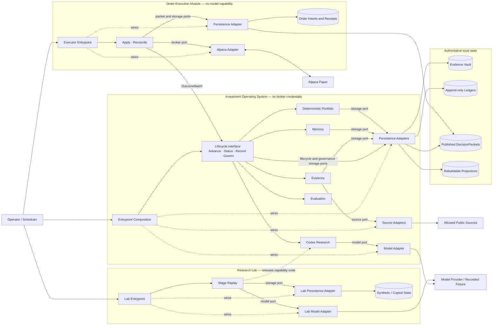
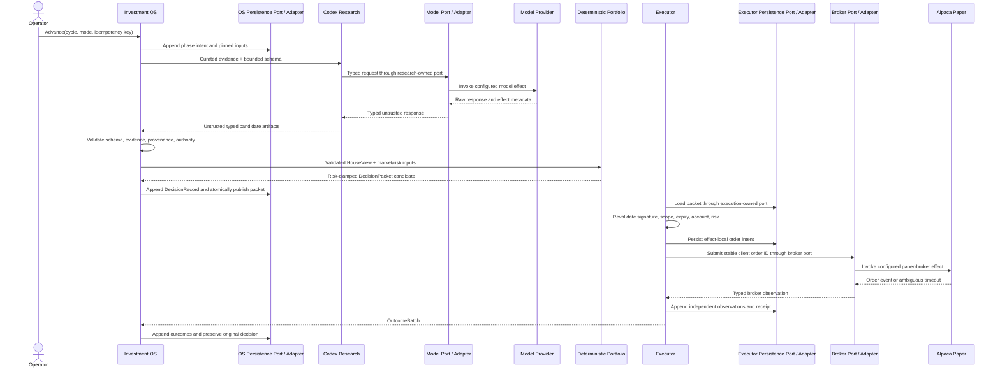
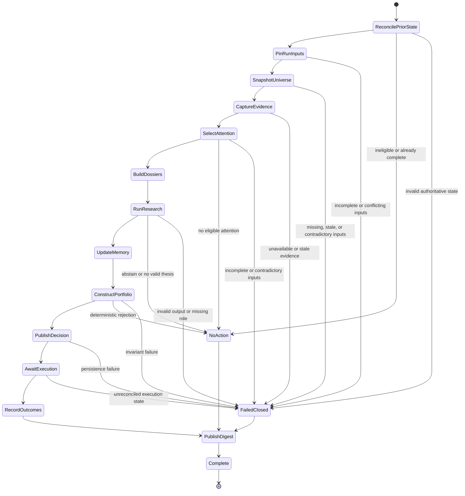

# Architecture

This document is the source of truth for accepted runtime topology, module seams, authority,
lifecycle-state meaning, authoritative state, effect ordering, and trust boundaries. It describes
contracts that implementation must preserve; the [README status table](../README.md#status) is the
capability-level delivery inventory.

Architecture does not own investment rules, product outcomes, Python import edges, runtime values,
test procedure, or design rationale. Those live in [the investment domain](investment-domain.md),
[product requirements](product-requirements.md), [the module graph](module-graph.md),
[the configuration catalog](config-catalog.md), [testing policy](testing.md), and
[ADRs](adr/README.md), respectively.

## Architectural spine

The system is one modular monolith with three separate process and trust seams. Entrypoints compose
owner-defined ports with adapters and give each process only its permitted capabilities. Capability
code cannot reach through an adapter to acquire an external effect or credential.

| Process and trust seam | Public capabilities | Effect authority | Authoritative state |
| --- | --- | --- | --- |
| Investment Operating System, without broker credentials | `Advance`, `Status`, `Record`, `Govern` | Source, model, and persistence effects through owner-defined ports | Evidence Vault; lifecycle, belief, governance, decision, and outcome ledgers; published `DecisionPacket` store |
| Order Execution Module, without model capability | `Apply`, `Reconcile` | Packet reads, executor persistence, and paper-broker effects through execution-owned ports | Published packets as input; order intents, broker observations, and execution receipts |
| Research Lab, isolated from production state and authority | `Replay` | Model and Lab-persistence effects through research-owned ports | Synthetic or copied inputs and one Lab-local append-only ledger |

The [topology](#system-topology) shows those seams and effect paths. [Public capabilities](#public-lifecycle-interfaces)
and [Research Lab](#research-lab-interface) own their stable contracts; [module ownership](#module-ownership)
and the [module graph](module-graph.md) place the Python seams. [Authority](#authority-and-trust),
[lifecycle](#session-lifecycle), and [durable state](#durable-state) own the non-negotiable rules.
A target contract here never proves that its runtime behavior is enabled.

## Design drivers

- Keep a local Python 3.12 modular monolith until measured constraints justify another deployment
  shape.
- Expose deep lifecycle capabilities while keeping research stages, persistence, and provider
  mechanics internal.
- Make evidence, beliefs, decisions, and outcomes append-only and reconstructable as of their
  original cutoffs.
- Keep model research outside deterministic portfolio, risk, governance, and broker authority.
- Persist intent before an external effect and give every effect an independently idempotent identity.
- Fail closed with a durable disposition when required state is stale, incomplete, contradictory, or
  invalid.
- Enforce safety-critical invariants at the earliest stable layer that can prove them.

## System topology



The Investment Operating System, executor, and Lab may share immutable domain contracts inside one
package, but they never share authority or credentials. The Lab is disjoint from production state;
the Investment Operating System and executor exchange only published packets and returned
`OutcomeBatch` values through the shown interfaces. Every arrow to a source, model, durable store, or
broker crosses an owner-defined port and its adapter. Entrypoints wire those implementations but do
not move effect authority into protected capabilities.

## Authority and trust

Authority moves only forward:

```text
captured evidence -> validated research -> HouseView -> deterministic portfolio
-> published DecisionPacket -> independent executor validation -> broker effect
```

- External text, provider data, durable representations, and model output remain hostile until their
  schema, evidence, time, provenance, and authority are validated at the receiving seam.
- Codex may propose evidence assertions, beliefs, theses, scenarios, stance, and challengers. It
  cannot choose accepted weights, construct executable packets or orders, control lifecycle or
  governance, supply operator approval, activate policy, or receive broker credentials.
- `portfolio` alone owns deterministic sizing and risk clamps. `execution` alone owns broker
  actions and cannot reinterpret or expand a packet's portfolio intent.
- The executor receives broker credentials and validated packets but no model capability. The
  Investment Operating System and Lab receive no broker credentials.
- Lab artifacts are explicitly non-production and cannot satisfy champion, portfolio, packet, or
  executor validation.
- Operator approval is required for the Constitution, objectives, evaluation rules, risk envelopes,
  execution policy, champion promotion, and any future live-capital design.

## Executable invariants

Rules protecting investment authority, determinism, provenance, append-only durability, or process
isolation require proportionate mechanical enforcement when the contract can be expressed without
duplicating or weakening its owner. Apply the earliest layer that can prove the rule:

1. closed types and constructors make invalid internal states difficult to represent;
2. module structure prevents forbidden dependencies and unreachable authority from becoming
   reachable;
3. seam validation refuses hostile representations before typed construction or authority handoff;
4. deterministic tests prove observable and temporal rules not established earlier; and
5. human review judges semantics and cases that cannot be encoded reliably.

The [module graph](module-graph.md) owns Python dependency direction; [testing policy](testing.md)
owns behavioral evidence and gate selection. A passing mechanical gate supports but never replaces
semantic review. A changed review or publication gate cannot approve itself.

### Capability effect boundaries

[ADR 0007](adr/0007-enforce-bounded-capability-effects.md) protects every production module except
`adapters/` and `entrypoints/`, which own external effects and composition. Protected capabilities
receive typed values or owner-defined ports; they cannot directly obtain wall-clock time, ambient
randomness or identifiers, host environment or local-time state, network or model access, broker
authority, database access, filesystem effects, or process control.

`make architecture` supplies bounded static evidence for this contract. Its fixed banned-API and
contextual checks reject known high-signal effect acquisition while allowing explicit injected
values, seeded local generators, and timezone conversion. It does not infer arbitrary control flow,
reflection, dynamic imports, protocol implementations, or interprocedural types. Extend the gate only
for a demonstrated pattern with denied and allowed fixtures. Adapters and entrypoints remain governed
by their process authority, module direction, behavioral tests, and review.

## Safe execution handoff



Model, persistence, and broker participants denote owner-defined ports and their configured adapters,
not capabilities that own those effects. Broker acceptance and timeout are independent facts.
Reconciliation resolves ambiguity by stable client order identity; it never guesses acceptance or
blindly repeats exposure.

## Module ownership

| Module | Owns | Public surface |
| --- | --- | --- |
| `domain` | Framework-free values, lifecycle transition policy, events, identifiers, invariants | Immutable contracts and lifecycle decisions |
| `application` | Production lifecycle and isolated-Lab orchestration | `Advance`, `Status`, `Record`, `Govern`, `Replay` |
| `evidence` | Content-addressed artifacts, assertions, as-of provenance | Evidence capture and lookup |
| `memory` | Belief ledger, graph projection, decision journal | Append and as-of retrieval |
| `research` | Typed Codex roles and evidence-bound workflow | Validated research artifacts |
| `portfolio` | HouseView validation, sizing, limits, target bands, packets | Deterministic construction |
| `execution` | Packet verification, order policy, idempotency, reconciliation | `Apply`, `Reconcile` |
| `evaluation` | Outcome resolution, benchmarks, calibration, challengers | Evaluation records |
| `adapters` | SQLite, filesystem, clocks, recorded-model, Codex, SEC, Alpaca | Owner-defined ports |
| `entrypoints` | Process composition, configuration, paths, credentials | CLI and scheduler surfaces |

An interface lives with the capability that owns its behavior. Adapters implement those interfaces;
entrypoints assemble them. [The module graph](module-graph.md) alone owns allowed import directions
and the distinction between policy and executable edges.

## Public lifecycle interfaces

Production entrypoints expose complete lifecycle capabilities, never individual research stages:

| Capability | Stable contract |
| --- | --- |
| **Advance** | Resolve or resume one supported `DecisionCycleIdentity`; validate governance history and pinned material before downstream work; return a versioned disposition, checkpoint, exact cycle, provenance references, and bounded refusal or replay. V0 unwraps only `MarketSession`. A malformed or disabled cycle is refused before a clock, adapter, authoritative ledger, or state preparation is entered. |
| **Status** | Validate authoritative history, rebuild its disposable projection, and report checkpoint, liveness, durable terminal reason, pinned run, Constitution state, and cycle-qualified snapshot and attention references. `last_completed_cycle` advances only from a durable `Complete` event. |
| **Record** | Validate and atomically append or replay an evidence-bound Belief Event; rebuild bounded as-of Belief Graph results from authoritative history. Outcome extensions append without changing ex-ante decisions. |
| **Govern** | Schedule one immutable, signed, operator-approved Constitution artifact at one exact eligible future `MarketSession`. Exact retry is idempotent; changed material conflicts. Only the operator composition root receives this object capability. |
| **Apply** | Independently validate one published `DecisionPacket`, manage only its authorized paper orders, and return an `ExecutionReceipt`. |
| **Reconcile** | Observe orders, activities, positions, and cash as independent broker facts; match stable identities and return an `OutcomeBatch` for `Record`. |

Typed interfaces own field-level schemas and [testing policy](testing.md#required-deterministic-scenarios)
owns observable success and refusal scenarios. Public results remain versioned, bounded, and explicit
about fresh work, resumed progress, prior completion, no action, conflict, or failed-closed outcome.

## Research Lab interface

`Replay` is the only public capability of an explicitly named non-production Lab namespace. It
accepts copied or synthetic evidence available by its pinned cutoff plus canonical subject mapping,
Constitution, bounded Belief Graph, portfolio-context fingerprint, prompt, model, tool schemas,
Data Regime, and material hashes. Every input is explicit, versioned, bounded, and revalidated before
the affected model boundary; ambient, future-available, inconsistent, reordered, or changed retry
material fails closed.

Each stateless role call crosses a research-owned model port. A Lab-owned persistence port appends the
canonical role intent before that effect and appends raw-response identity, exposed model identity,
resource use, timing disposition, and validated artifact or bounded refusal afterward. Stable
effect-local identity includes namespace, Replay request, and role. A completed retry returns its
prior observation without invoking the model. An intent without an observation is an indeterminate
prior effect and is never repeated automatically.

The fixed role order and investment meaning belong to
[the research workflow](investment-domain.md#research-workflow); typed contracts own their exact
schemas. The Lab admits only declared, evidence-bound fields and recursively refuses position sizing,
targets, packets, orders, broker, governance, lifecycle-control, memory-write, credential, tool, or
other authority directives. Every accepted artifact and receipt is marked
`research_lab_non_production`; no Lab composition receives a Champion store, production-state
writer, execution port, or broker credential.

The Lab state root is an explicit private path, symlink-free, repository-safe, and disjoint from every
production root. Its namespace metadata, intents, and observations are immutable. Existing schema,
integrity, namespace, hash, or reconstruction failure stops replay before another model effect.
Composition requires an explicit model port; deterministic tests use scripted recorded fixtures.
There is no network, credential, metered default, or fallback.

## Session lifecycle

The V0 operating system is a checkpointed state machine over append-only records. A pure,
framework-free domain kernel reconstructs typed authoritative history and selects the next event,
refusal, conflict, or receipt. Application code drives the kernel to a terminal receipt. Persistence
adapters validate hostile representations and atomically append only the selected record; they do not
own phase ordering or recovery policy. [ADR 0002](adr/0002-lifecycle-policy-in-domain-kernel.md)
records this ownership.

The active kernel remains specific to `MarketSession`. The application boundary validates the closed
`DecisionCycleIdentity` and unwraps only that variant; the equity planner resolves schedule,
Evidence Cutoff, and due reconciliation obligations. The kernel reads no calendar and contains no
asset-class switch. A future lifecycle owns its own planner and transitions and may justify common
machinery only after a second concrete implementation proves it.



The state meanings and transition contracts are:

- Every effect has a durable intent before work and an observed result before the lifecycle advances.
  Retry replays a completed disposition or resumes only from the last safe checkpoint.
- `PinRunInputs` fixes cycle identity, Constitution version and hash, configuration, Data Regime,
  Evidence Cutoff, universe and position inputs, and material policy fingerprints. Changed retry
  material conflicts before further work.
- A new request selects governance for its eligible session. An existing stream always reconstructs
  the governance prefix visible at its first event, so later activation never rewrites an interrupted
  run. Missed boundaries, invalid proofs, or unresolved lifecycle-to-governance references fail closed.
- `SnapshotUniverse` publishes the prepared canonical envelope once. `CaptureEvidence` and all
  later effectful phases reuse the exact pinned inputs and identities rather than consulting ambient
  state.
- `NoAction` is an expected durable outcome; `FailedClosed` records why safe progress is impossible.
  Neither publishes a new discretionary order. Required missing or unreconstructable reconciliation
  obligations force `FailedClosed`.
- Option expiration, exercise, and assignment enter the equity lifecycle as due reconciliation
  obligations, never as extra `MarketSession` phases.
- Status derives only from validated event, refusal, and conflict ledgers. It may discard and rebuild
  a projection, but malformed authoritative history fails closed. Operational scheduler heartbeat is
  not lifecycle liveness.

Narrative journeys and transition fault cases belong to
[required deterministic scenarios](testing.md#lifecycle-and-durability), not this document. A future
orchestration adapter may change implementation mechanics only if it preserves these states,
checkpoints, effects, dispositions, and idempotency rules.

## Durable state

| Authoritative state | Owner | Mutation contract |
| --- | --- | --- |
| Evidence artifacts and observations | Content-addressed Evidence Vault | Store content immutably; append source observations, availability, mappings, and refusals |
| Beliefs | Bitemporal Belief Ledger | Append transitions and corrections; preserve the complete chain and integrity anchor |
| Decisions and outcomes | Decision Journal | Freeze ex-ante decisions; append observations, attribution, and lessons |
| Governance | Constitution governance ledger | Append scheduled, activated, refused, and conflicting facts plus approval proof |
| Lifecycle and attention | Lifecycle event ledger | Append intents, transitions, checkpoints, artifacts, refusals, and conflicts under stable identities |
| Published packets | Atomic packet store | Publish only complete, validated, immutable packets |
| Executor intent and observations | Executor ledger | Persist effect intent first; append broker observations and receipts independently |
| Research Lab calls and artifacts | Namespace-local Lab ledger | Append role intent before effect and one observation or bounded refusal afterward |
| Graphs, reports, indexes, status | Projection stores | Replace only by deterministic rebuild from validated authority |

Every authoritative record has a closed envelope and payload with independent schema versions; the
envelope discriminator is parsed before its payload. Relevant event and availability times, authority
scope, material configuration and source fingerprints, canonical subject or cycle identity, and
content hash are explicit where applicable. Readers reconstruct canonical values and hashes instead
of trusting stored summaries. Unknown variants, unsupported versions, missing references,
incompatible authority, or corrupt hashes fail closed at the first seam.

Financial history is append-only. Corrections name what they supersede; exact redelivery replays its
receipt; changed material under an existing identity conflicts. Content-addressed bytes may be shared,
but separate observations and effects keep distinct identities. An effect's idempotency key derives
from canonical authority inputs, never a display symbol or mutable alias.

All model-visible inputs and material decisions are reconstructable from their content, relevant
times, Data Regime, configuration, prompt and model identity, tool contract, source provenance, and
durable records. Evidence availability—not merely source-event time—must satisfy the pinned cutoff.
Official source identity binds immutably to its observed content and publication facts; amendments
append rather than replace. Projections never authorize behavior and cannot become a second source of
truth.

Lifecycle, belief, governance, executor, and Lab ledgers validate their complete request-relevant
history before replay or append. Each atomic belief append writes its event and commitment, then
advances a singleton integrity anchor by exactly one from its exact predecessor; reconstruction
requires that anchor to match the validated chain terminal, making suffix truncation detectable.
Governance event time never moves backward. Scheduling or activation validates the candidate
governance history against every lifecycle Constitution use in the same transaction as its append, so
a new regime cannot invalidate an earlier or interrupted run. Capture, model, and broker effects
persist their exact intent before crossing the port, then append the independent observation before
progress. Ambiguous prior effects remain indeterminate until reconciliation; retry never manufactures
an observation or repeats exposure.

SQLite owns one database-wide physical schema version, independent of durable-record and run schema
versions. Its adapter atomically initializes an empty database or validates the exact current schema;
every other non-empty version or shape fails before lifecycle writes. Disposable projections remain
outside authoritative schema identity and may be rebuilt, but they cannot mask corruption in
authoritative or global structures. [ADR 0004](adr/0004-require-current-sqlite-schema.md) owns this
current-schema decision.

SQLite is the initial event and checkpoint store; the filesystem holds content-addressed artifacts
and atomic packet publications. Runtime state uses ignored configurable roots such as `var/`,
`data/`, and `artifacts/`; source directories never serve as runtime storage.

## Temporal semantics

[ADR 0006](adr/0006-separate-absolute-instants-from-market-time.md) separates the shared timeline from
asset-owned calendar meaning. Every Absolute Instant crossing deterministic code, a durable boundary,
a process or model boundary, or telemetry is UTC at microsecond precision. Canonical durable text is
fixed-width ISO 8601 with `+00:00`. Naive, over-precise, malformed, or noncanonical durable values
fail closed at their owner.

A `MarketSession` is an NYSE trading date, not a midnight instant. Equity schedule policy interprets
holidays, early closes, and daylight-saving changes through the NYSE calendar and
`America/New_York`, then resolves each cutoff or deadline to an Absolute Instant. Host-local,
displayed, or provider-spelled time is not authoritative. Timeouts and latency use monotonic elapsed
time. These are fixed architecture, not runtime timezone configuration.

## Configuration and deployment

Entrypoints resolve typed configuration, explicit defaults, paths, and secret references before
constructing a process. Material policy is versioned and hashed into the run record. Secret values
exist only in their credentialed entrypoint or adapter environment and never enter configuration
artifacts, logs, fixtures, durable research, or model context.
[The configuration catalog](config-catalog.md) owns implemented keys and defaults.

V0 runs locally on one Mac under an NYSE-calendar-aware scheduler. Live network rehearsals and Alpaca
paper access remain explicitly invoked operations outside deterministic developer gates.

## Multi-asset extension constraint

[PR-CON-006](product-requirements.md#operational-constraints) and
[ADR 0005](adr/0005-share-core-contracts-with-typed-asset-variants.md) require one deterministic core
with closed asset-class-owned variants. The target vocabulary includes `us_equity`, `crypto_spot`,
and `listed_option`; V0 composition enables only `us_equity`. Provider capability is boundary
evidence, never activation authority. Describing a variant here does not authorize its research,
portfolio, risk, data, or execution behavior.

`DecisionCycleIdentity` is the closed cycle union. `MarketSession` is the equity variant and the
only V0 kernel input. A future `CryptoDecisionWindow` is UTC-bounded, owns its 24/7 scheduling
policy, and may exist when the equity planner produces no eligible session. Option expiration,
exercise, and assignment are reconciliation obligations rather than cycle identities.

Every durable instrument reference uses a versioned `InstrumentIdentity` union with asset-class
discriminator, provider-and-environment catalog namespace, and opaque catalog identifier. Display
symbols and provider enums are alias provenance, never join keys, foreign keys, or idempotency inputs.
Adapters must prove one-to-one mappings at the pinned cutoff before constructing an identity.
Missing, reused, or contradictory mappings fail closed.

- Equity identity carries its listing venue; status, tradability, and fractionability are observations.
- Crypto spot identity carries base and quote currencies plus execution venue; pair spellings are
  aliases.
- Listed-option identity carries a supported equity underlying, expiration, right, exercise style,
  exact strike and currency, and versioned multiplier and deliverable. An index or unknown underlying
  is unsupported until a separately approved variant exists.

### Shared core and variant ownership

| Concept | Shared deterministic core | Asset-owned variant |
| --- | --- | --- |
| Identity and provenance | Closed discriminators, canonical bytes, hashes, aliases, referential integrity | Equity listing; crypto pair and venue; option contract and terms |
| Data and time | Cutoff, availability, source, entitlement, Data Regime, staleness, cycle envelope | Feed, venue, parser, calendar, payload, and phase policy |
| Quantity and positions | Exact decimal, explicit unit and currency, versioned snapshot | Shares, coin or pair units, contracts, multiplier, settlement relation |
| Orders and packets | Packet integrity, authority, expiry, deterministic risk approval, stable effect identity | Allowed shape, quantity, price, session, time-in-force, replace policy |
| Activities and reconciliation | Intent-before-effect, independent observations, receipts, rebuildable outcomes | Fills, fees, exercise, assignment, expiration, position and cash effects |

Common snapshots, events, packets, and receipts carry one versioned envelope and exactly one closed
payload variant. Flat records with unrelated nullable asset fields are invalid. Asset payloads state
exact units and never infer class from symbols. Unknown discriminators, disabled classes, incompatible
capability profiles, or malformed variants fail closed on write and read.

### Eligible-universe compatibility

Universe and position snapshots use canonical instrument references, observed and available times,
Data Regime, authority scope, source fingerprint, content hash, exact quantity and unit, and explicit
valuation provenance. New-entry eligibility remains distinct from holding refresh. A disabled-class
holding is an explicit portfolio mismatch that blocks discretionary progress; it is never dropped or
silently activated.

The application accepts the common cycle envelope but V0 unwraps only `MarketSession`.
`Status` keeps completed cycle, universe snapshot cycle and identifier, and attention cycle and
identifier distinct. Cycle, snapshots, eligibility policy, cutoff, and Data Regime are pinned; changed
retry inputs conflict. Persistence validates discriminators, exact fields, canonical hashes, and
references on every reopen rather than storing provider enums or symbol foreign keys.

Validated configuration must contain exactly the supported equity class and matching equity-universe
policy. Crypto, options, unknown or duplicate classes, policy mismatch, and provider entitlement alone
fail before state preparation or any source, model, packet, credential, or broker effect. The
[asset-extension scenarios](testing.md#asset-extension-seams) own executable compatibility evidence.

### Composition and extension budget

The V0 entrypoint statically composes only equity variants; there is no dynamic plugin registry or
runtime discovery. Adding an asset class may add one closed identity, cycle-plan, instrument,
position, order-intent, and activity variant; asset-owned eligibility, portfolio, risk, execution,
and reconciliation policy; provider adapters and fixtures; versioned configuration with explicit
activation; and proportionate verification.

A new lifecycle owns its phase and checkpoint sequence. It cannot add class branches to the
`MarketSession` kernel or change existing public lifecycle dispositions, common durable envelopes,
canonical hashing, packet integrity, receipt reconstruction, intent-before-effect, idempotency,
append-only correction, projection rebuild, or process authority separation. Any demonstrated
exception changes this document and receives an ADR before implementation. Later activation must
also satisfy PR-CON-001's existing-entitlement and no-metered-fallback constraint.

## Changing the architecture

Update this document only when a change alters runtime topology, trust, authority, module ownership,
public capability meaning, lifecycle states, authoritative state, effect ordering, reconstruction, or
cross-capability compatibility. A field inventory, validator rule, test scenario, configuration key,
or design rationale belongs to its typed interface, domain document, testing policy, configuration
catalog, or ADR.

Record an ADR when the architecture choice is costly to reverse, surprising without context, and
made through a real trade-off. Update the module graph, defensive patterns, configuration catalog,
and testing policy only when their owned facts also change.
