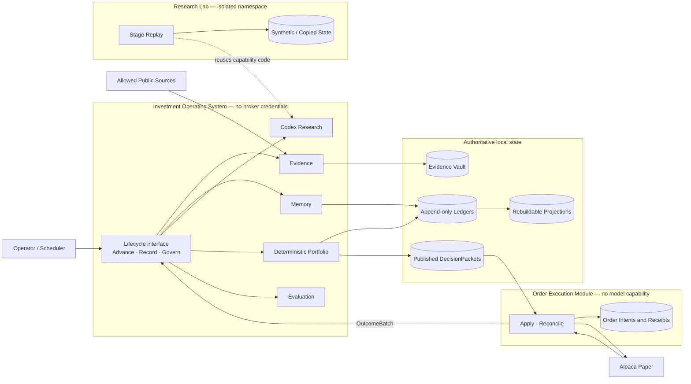
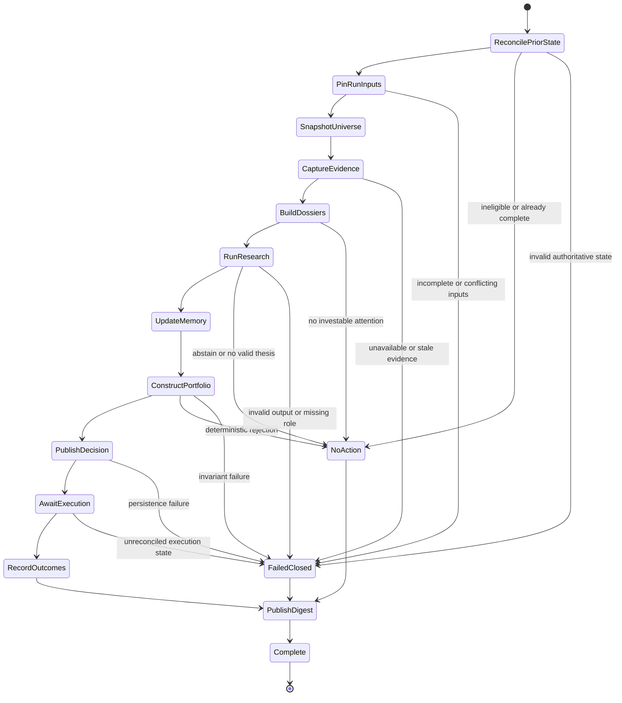
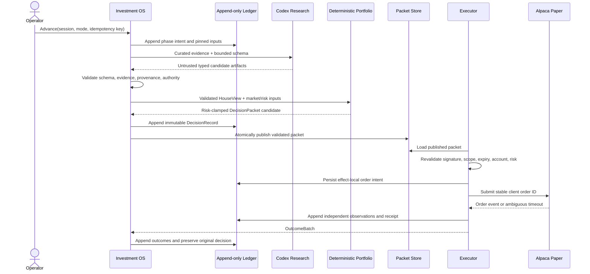

# Architecture

This document is the source of truth for the accepted system architecture: runtime shape, module
seams, authority, lifecycle, durable state, and trust boundaries. It describes the architecture that
implementation must preserve even while the repository is still a scaffold. The README states
implementation status.

Architecture does not own investment rules, product outcomes, Python import edges, runtime values,
test procedure, or design rationale. Those live in `investment-domain.md`,
`product-requirements.md`, `module-graph.md`, `config-catalog.md`, `testing.md`, and ADRs respectively.

## Design drivers

- Keep a local Python 3.12 modular monolith until measured constraints justify another deployment
  shape.
- Expose deep lifecycle interfaces while keeping research stages, persistence, and provider mechanics
  internal.
- Make evidence, beliefs, decisions, and outcomes append-only and reconstructable as of their original
  cutoffs.
- Keep model research outside deterministic portfolio, risk, and broker authority.
- Persist intent before external effects and make every effect independently idempotent.
- Fail closed with a durable disposition when required state is stale, incomplete, contradictory, or
  invalid.

## System topology



The three process seams are the Investment Operating System, Order Execution Module, and Research
Lab. They may share immutable domain contracts inside one package; they do not share authority or
credentials.

## Public lifecycle interfaces

Normal production callers see five capabilities:

- **Advance** resolves or resumes a market session and returns a receipt containing its disposition,
  completed phase, pinned inputs, published artifact identifiers, and fail-closed reason.
- **Record** appends due market, forecast, thesis, and execution observations without changing the
  original decision.
- **Govern** schedules a signed, operator-approved Constitution, champion, or controlled-policy
  change for a future session boundary.
- **Apply** independently validates one published `DecisionPacket`, manages only its permitted paper
  orders, and returns an `ExecutionReceipt`.
- **Reconcile** observes broker orders and positions, matches stable client order identifiers, and
  returns an `OutcomeBatch` for `Record`.

Production entrypoints do not expose individual research stages. Stage replay belongs to the Research
Lab and can write only to its own namespace.

## Session lifecycle

The operating system is a checkpointed state machine over append-only records. Each transition
persists intent before work and appends its observed result before advancing. Repeating a request
returns its prior disposition or resumes from the last safe checkpoint.



`NoAction` is an expected, durable outcome. `FailedClosed` records why the session cannot safely
continue. Neither state publishes a new discretionary order. A later LangGraph adapter may replace
the transition implementation but must preserve this interface, state meaning, checkpoints, and
idempotency behavior.

## Safe execution handoff



Timeout and broker acceptance remain independent facts. Reconciliation resolves ambiguity by stable
client order identity; it never guesses or repeats exposure blindly.

## Module ownership

| Module | Owns | Interface presented to callers |
| --- | --- | --- |
| `domain` | Framework-free values, events, identifiers, and invariants | Immutable domain contracts |
| `application` | Lifecycle transitions and use-case orchestration | `Advance`, `Record`, `Govern` |
| `evidence` | Content-addressed artifacts, assertions, as-of provenance | Evidence capture and lookup |
| `memory` | Belief ledger, graph projection, decision journal | Append and as-of retrieval |
| `research` | Typed Codex roles and evidence-bound workflow | Validated research artifacts |
| `portfolio` | HouseView validation, sizing, limits, target bands, packets | Deterministic construction |
| `execution` | Packet verification, order policy, idempotency, reconciliation | `Apply`, `Reconcile` |
| `evaluation` | Outcome resolution, benchmarks, calibration, challengers | Evaluation records |
| `adapters` | SQLite, filesystem, clock, Codex, SEC, Alpaca implementations | Owner-defined ports |
| `entrypoints` | Process composition, configuration, paths, credentials | CLI and scheduler surfaces |

An interface lives with the module that owns its behavior. Adapters satisfy those interfaces;
entrypoints assemble them. `module-graph.md` owns allowed Python import directions and the distinction
between policy and executable edges.

## Authority and trust

The authority chain is monotonic:

```text
captured evidence -> validated research -> HouseView -> deterministic portfolio
-> published DecisionPacket -> independent executor validation -> broker effect
```

- External text and model output are hostile data until schema, evidence, time, and authority
  validation succeeds.
- Codex may propose evidence assertions, beliefs, theses, scenarios, stance, and challengers. It has
  no broker credentials and cannot choose accepted weights, construct executable packets, create
  orders, change lifecycle control, or activate policy.
- `portfolio` alone owns deterministic sizing and risk clamps. `execution` alone owns broker actions
  and cannot change the packet's portfolio intent.
- The executor process receives broker credentials and validated packets but no model capability.
- Research Lab artifacts are marked non-production and cannot satisfy champion or executor
  validation.
- Operator approval is required for Constitution, objectives, evaluation rules, risk envelopes,
  execution policy, champion promotion, and any future live-capital design.

## Durable state

| State | Authority | Mutation rule |
| --- | --- | --- |
| Evidence artifacts | Content-addressed Evidence Vault | Immutable; repeated observations append metadata |
| Beliefs | Bitemporal Belief Ledger | Append transitions and corrections |
| Decisions | Decision Journal | Freeze ex-ante record; append later observations |
| Order intent and receipts | Executor ledger | Persist intent before effect; append observations |
| Lifecycle checkpoints | Lifecycle event ledger | Append transitions under stable idempotency keys |
| Graphs, reports, indexes | Projection stores | Replace only by deterministic rebuild |
| Executable packets | Atomic packet store | Publish complete validated artifacts only |

Every model-visible input and material decision is reconstructable from content hashes, relevant time
dimensions, configuration, prompt and model identity, and durable records. Corrections name what they
supersede; they do not rewrite prior financial history.

SQLite is the initial event and checkpoint store, while the filesystem holds content-addressed
artifacts and atomic publications. Runtime state uses ignored, configurable roots such as `var/`,
`data/`, and `artifacts/`; source directories never serve as runtime storage.

## Configuration and deployment

Entrypoints resolve typed configuration, explicit defaults, paths, and secret references before
constructing a process. Material policy is versioned and hashed into the run record. Secret values
exist only in the credentialed entrypoint or adapter environment and never enter configuration
artifacts, logs, fixtures, or model context. `config-catalog.md` owns the implemented configuration
surface.

V0 runs locally on one Mac under an NYSE-calendar-aware scheduler. Live network rehearsals and Alpaca
paper access remain explicitly invoked operations outside the deterministic developer gate.

## Changing the architecture

Update this document when a change alters runtime topology, a module seam or interface, authority,
lifecycle states, authoritative state, or a trust boundary. Record an ADR only when the choice is
costly to reverse, surprising without context, and the result of a real trade-off. Update the module
graph, defensive patterns, configuration catalog, and testing policy only when their owned facts also
change.
