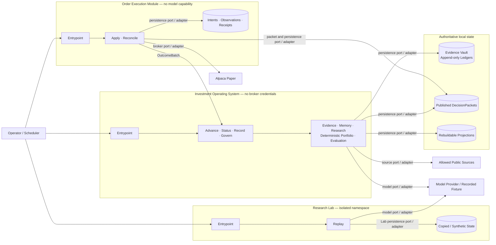
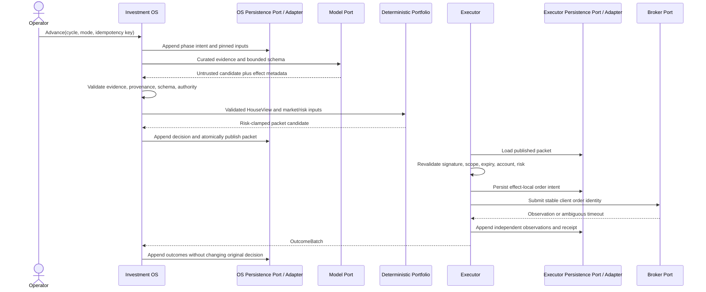
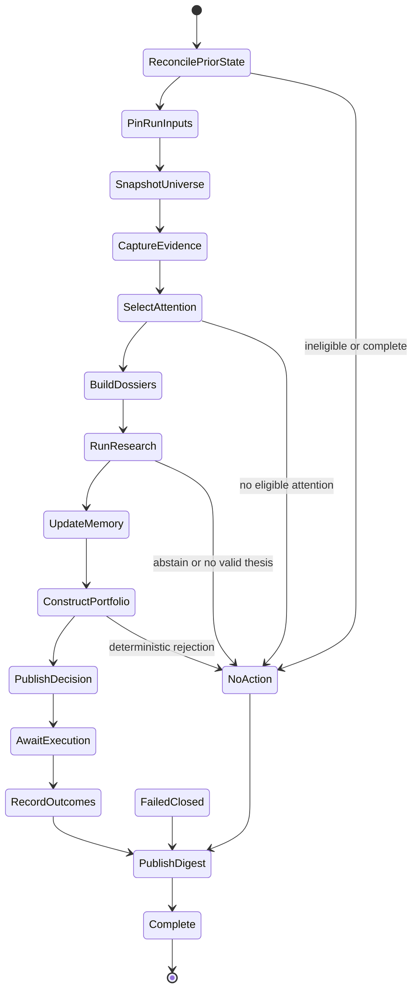

# Architecture

This document owns runtime topology, module and trust seams, authority, lifecycle-state meaning,
authoritative state, effect ordering, and cross-capability compatibility. Implementation preserves
these contracts; the [README status table](../README.md#status) records delivered capabilities.

Investment rules, outcomes, import edges, runtime values, tests, and rationale live in the
[investment domain](investment-domain.md), [product requirements](product-requirements.md),
[module graph](module-graph.md), [configuration catalog](config-catalog.md), [testing](testing.md),
and [ADRs](adr/README.md).

The [threat model](threat-model.md) owns material threat enumeration, control coverage, and residual
risk without changing the contracts declared here.

## Architectural spine

The system is a local Python modular monolith with three process and trust seams:

| Process | Public capabilities | Permitted effects and authoritative state |
| --- | --- | --- |
| Investment Operating System, without broker credentials | `Advance`, `Status`, `Record`, `Govern` | Source, model, and persistence effects through owned ports; Evidence Vault, production ledgers, and published packets |
| Order Execution Module, without model capability | `Apply`, `Reconcile` | Packet reads, executor persistence, and paper-broker effects through owned ports; order intents, observations, and receipts |
| Research Lab, isolated from production authority | `Replay` | Model and Lab-persistence effects through research-owned ports; copied or synthetic inputs and a Lab-local ledger |

Entrypoints compose adapters and give each process only its permitted capabilities and credentials.
Capabilities expose lifecycle outcomes, not internal stages; evidence, beliefs, decisions, and
outcomes remain append-only and reconstructable. Deterministic code alone owns portfolio, risk,
packet, order, and reconciliation decisions; invalid required state produces a durable refusal.

Navigate by [topology and trust](#system-topology), [authority and effects](#authority-and-trust),
[module and capability seams](#module-ownership), [lifecycle](#session-lifecycle),
[durable state](#durable-state), [time and configuration](#temporal-semantics), and
[multi-asset compatibility](#multi-asset-extension-constraint).

## System topology



The processes may share immutable domain contracts, but never authority or credentials. The Lab is
disjoint from production state. The operating system and executor exchange only published packets
and returned `OutcomeBatch` values. Every external or durable effect crosses an owner-defined port;
entrypoint wiring does not transfer that authority into a capability.

## Authority and trust

Authority moves only forward:

```text
captured evidence -> validated research -> HouseView -> deterministic portfolio
-> published DecisionPacket -> independent executor validation -> broker effect
```

- External text, provider data, durable rows, and model output remain hostile until validated for
  schema, evidence, time, provenance, and authority at the receiving seam.
- Codex may propose research artifacts. It cannot choose accepted weights, construct packets or
  orders, control lifecycle or governance, approve policy, or receive broker credentials.
- `portfolio` alone owns deterministic sizing and risk clamps. `execution` alone owns broker actions
  and cannot reinterpret or expand packet intent.
- The executor receives validated packets and broker credentials but no model capability. The
  operating system and Lab receive no broker credentials; Lab artifacts have no production authority.
- Operator approval remains the root for the Constitution, objectives, evaluation and risk policy,
  execution policy, champion promotion, and any future live-capital design.

## Executable invariants

Protect authority, determinism, provenance, append-only durability, and isolation at the earliest
stable layer: closed types, module structure, seam validation, deterministic tests, then semantic
review. A mechanical pass proves only its bounded claim and cannot approve a changed review or
publication gate. [The module graph](module-graph.md) owns dependency direction; [testing](testing.md)
owns behavioral evidence.

### Capability effect boundaries

Except for `adapters/` and `entrypoints/`, production modules receive typed values or owner-defined
ports and cannot directly obtain clocks, ambient randomness or identifiers, environment or local-time
state, network or model access, broker authority, database or filesystem access, or process control.
`make architecture` enforces common high-signal acquisitions; it is bounded static evidence, not a
claim about arbitrary control flow or semantic correctness. [ADR 0007](adr/0007-enforce-bounded-capability-effects.md)
owns the enforcement trade-off.

## Safe execution handoff



Each external effect has a durable intent and effect-local idempotency identity before invocation;
its observation is appended before lifecycle advance. Timeout and acceptance are independent facts.
Reconciliation resolves ambiguity from broker facts and stable identities; retry never guesses or
blindly repeats exposure.

## Module ownership

| Module | Owns |
| --- | --- |
| `domain` | Framework-free values, lifecycle transition policy, events, identifiers, invariants |
| `application` | Production lifecycle and isolated-Lab orchestration |
| `evidence` | Content-addressed artifacts, assertions, as-of provenance |
| `memory` | Belief ledger, graph projection, decision journal |
| `research` | Typed Codex roles and evidence-bound workflow |
| `portfolio` | HouseView validation, sizing, limits, target bands, packets |
| `execution` | Packet verification, order policy, idempotency, reconciliation |
| `evaluation` | Outcome resolution, benchmarks, calibration, challengers |
| `adapters` | SQLite, filesystem, clocks, model, source, and broker implementations |
| `entrypoints` | Process composition, configuration, paths, and credentials |

An interface lives with the capability that owns its behavior; adapters implement it and entrypoints
assemble it. [The module graph](module-graph.md) alone owns allowed Python imports.

## Capability seams

Entrypoints expose complete capabilities, never individual research stages:

| Capability | Architectural contract |
| --- | --- |
| `Advance` | Resolve or resume one supported cycle; validate governance and pinned inputs; build bounded Dossiers; run the fixed stateless production research roles; admit validated CIO resolutions to memory; and return an explicit fresh, resumed, replayed, no-action, conflict, or failed-closed disposition. V0 accepts only `MarketSession`. |
| `Status` | Validate authoritative lifecycle, evidence, Constitution, and production model-call history; rebuild disposable projections; and report the durable checkpoint, liveness, terminal reason, pins, and cycle-qualified references. Only `Complete` advances the completed cycle. |
| `Record` | Atomically append or replay evidence-bound belief and outcome facts; rebuild bounded as-of views without changing ex-ante decisions. |
| `Govern` | Schedule an immutable, signed, operator-approved Constitution for one exact eligible future session. Exact retry replays; changed material conflicts. |
| `Apply` | Independently validate one published packet, manage only its authorized paper orders, and return an execution receipt. |
| `Reconcile` | Observe broker orders, activities, positions, and cash as independent facts; match stable identities and return an `OutcomeBatch`. |
| `Replay` | Run one explicit, versioned, cutoff-pinned non-production research replay with effect-local intent, observation, refusal, and retry identity. |

Typed interfaces own field schemas; [testing policy](testing.md#required-deterministic-scenarios) owns
success, refusal, replay, and recovery scenarios.

Lab outputs are marked `research_lab_non_production`; authority-shaped fields are refused. The Lab has
no production writer, Champion store, execution port, broker credential, implicit network, or metered
fallback. Its private immutable state is disjoint from production; failed reconstruction or an
intent without observation stops model effects. [The investment domain](investment-domain.md#research-workflow)
owns role order and meaning.

## Session lifecycle

The V0 lifecycle is a checkpointed state machine over append-only records. Its pure domain kernel owns
reconstruction, transition order, refusals, conflicts, and recovery; application drives it to a
terminal receipt while persistence validates and atomically appends only the selected record. The
kernel remains specific to `MarketSession`, reads no calendar, and has no asset-class switch.
[ADR 0002](adr/0002-lifecycle-policy-in-domain-kernel.md) owns this seam.



- Any phase enters `FailedClosed` when its required authority, input, output, persistence, or
  reconciliation state cannot be validated.
- `PinRunInputs` fixes the cycle, Constitution, configuration, Data Regime, Evidence Cutoff, universe,
  positions, and material policy. Changed retry material conflicts before further work.
- A new stream selects governance at its exact eligible session; an existing stream preserves the
  governance prefix visible at its first event. Missed activation boundaries, invalid approval proof,
  or unresolved lifecycle-to-Constitution references fail closed.
- `SnapshotUniverse` publishes canonical inputs once. Later phases reuse those exact pins and
  identities rather than ambient state.
- `BuildDossiers` consumes only requests named by the exact Attention Artifact, including every due
  holding refresh. `RunResearch` constructs a fresh context for each fixed role from validated
  predecessor artifacts; no role inherits conversation state. `UpdateMemory` invokes `Record` only
  for validated non-abstaining CIO resolutions and advances only after every required append or replay
  is observed.
- `NoAction` is an expected durable outcome; `FailedClosed` records why progress is unsafe. Neither
  publishes a discretionary order. No admitted attention, Skeptic rejection, and CIO abstention are
  durable no-action reasons. Missing reconciliation obligations require `FailedClosed`.
- Option exercise, assignment, and expiration enter as reconciliation obligations, not lifecycle
  phases. Status comes only from validated ledgers; scheduler heartbeat is not lifecycle liveness.

## Durable state

| Authority | Owner and mutation contract |
| --- | --- |
| Evidence | Content-addressed Vault; immutable content and appended observations, mappings, availability, and refusals |
| Production ledgers | Belief, decision, outcome, governance, lifecycle, and attention facts appended under their owner contracts |
| Production research calls | Effect-local intent before each model call, followed by one raw-response identity and validated role artifact or bounded refusal |
| Published packets | Atomic store; complete, validated, immutable packets only |
| Execution | Executor ledger; intent first, then independent broker observations and receipts |
| Research Lab | Namespace-local ledger; role intent first, then observation or bounded refusal |
| Graphs, reports, indexes, status | Non-authoritative projections replaceable only by deterministic rebuild |

- Authoritative envelopes and closed payloads have independent versions and an explicit discriminator.
  Canonical identities, relevant event and availability times, authority, material configuration and
  source fingerprints, and hashes are reconstructable; unknown, missing, or corrupt material fails.
- Financial history is append-only. Corrections name their predecessor; exact redelivery replays and
  changed material under the same identity conflicts. Mutable aliases never become durable keys.
- Every model-visible input and material decision is reconstructable as of its pinned cutoff.
  Availability, not source-event time alone, gates evidence; projections never authorize behavior.
- Ledgers validate relevant history before replay or append. The singleton belief anchor starts at
  position one, advances atomically by exactly one from its exact predecessor, cannot be deleted or
  rolled back, and must equal the complete chain terminal.
- Governance time is monotonic. Scheduling or activation validates candidate governance history
  against every lifecycle Constitution use in the same append transaction, so a new regime cannot
  invalidate an earlier or interrupted run.
- Effects preserve intent and observation independently. A production model intent pins the run,
  request, exact role input, Constitution, cutoff, Data Regime, research-policy fingerprint, prompt,
  model, reasoning, inert tools, material hashes, and resource bounds before the effect. An intent
  without an observation is indeterminate and is never called again automatically. Lifecycle research
  checkpoints retain call IDs, artifact IDs, tokens, and turns; `Status` revalidates the model ledger
  by re-parsing retained responses, proves exact phase ownership and resource totals, and proves every
  checkpoint and memory reference still resolves. SQLite initializes or validates one exact current
  physical schema; other non-empty shapes fail before writes.
  [ADR 0004](adr/0004-require-current-sqlite-schema.md) owns that decision. Runtime stores use explicit
  ignored roots; source directories never hold runtime state.

## Temporal semantics

Every Absolute Instant crossing deterministic, durable, process, model, or telemetry boundaries is
canonical UTC at microsecond precision; noncanonical durable values fail closed. `MarketSession` is
an NYSE trading date, not an instant. Equity policy resolves exchange-calendar rules and
`America/New_York` deadlines to Absolute Instants; host, display, and provider time are never
authority, and timeout measurement is monotonic.
[ADR 0006](adr/0006-separate-absolute-instants-from-market-time.md) owns the representation.

## Configuration and deployment

Entrypoints resolve validated, typed configuration, explicit defaults, paths, and secret references
before composition. Material policy is versioned and hashed into the run. Secrets remain inside the
credentialed entrypoint or adapter environment and never enter logs, fixtures, durable research, or
model context. [The configuration catalog](config-catalog.md) owns implemented values. V0 runs under
an NYSE-calendar-aware local scheduler; network and paper-broker rehearsals are explicit operations.

## Multi-asset extension constraint

[ADR 0005](adr/0005-share-core-contracts-with-typed-asset-variants.md) defines one deterministic core
with closed asset-owned variants: target vocabulary includes `us_equity`, `crypto_spot`, and
`listed_option`, but V0 enables only `us_equity`. Entitlements and target descriptions never activate
research, portfolio, risk, data, or execution authority.

| Shared and invariant | Asset-owned and closed |
| --- | --- |
| Public lifecycle results, provenance envelopes, append-only events, packet integrity, effect identity, receipts, reconstruction | Instrument identity and terms, schedule and lifecycle policy, quantities and units, order constraints, activities and settlement |

`MarketSession` is the only current cycle. A future crypto window owns UTC-bounded 24/7 scheduling and
may exist when the equity planner has no eligible session; option exercise, assignment, and expiration
remain reconciliation facts. Durable instrument identity combines a canonical asset discriminator
with provider-and-environment catalog identity. Symbols and provider enums are aliases, never keys.
Adapters prove one-to-one mapping at the pinned cutoff; variants carry exact units and reject unrelated
nullable fields, unknown variants, or disabled classes.

Universe and position snapshots pin identity, cutoff, availability, Data Regime, authority, source,
hash, quantity, unit, and valuation provenance. Entry eligibility differs from holding refresh; a
disabled-class holding blocks the portfolio rather than being dropped or activated. V0 rejects
non-equity or mismatched policy before state preparation or any external effect.

A new asset may add closed variants, its own lifecycle and policy, adapters, configuration, and tests.
It cannot branch the `MarketSession` kernel or change process authority, public dispositions, common
envelopes and hashing, packet integrity, receipt reconstruction, intent-before-effect, idempotency,
append-only correction, or projection rebuild. Exceptions need an architecture change and ADR before
implementation; activation retains the no-metered-fallback constraint.

## Changing the architecture

Change this document only for topology, trust, authority, ownership, capability meaning, lifecycle or
authoritative state, effect ordering, reconstruction, or compatibility. Field inventories, validators,
scenarios, configuration, and rationale belong to their owners; hard-to-reverse trade-offs need an ADR.
