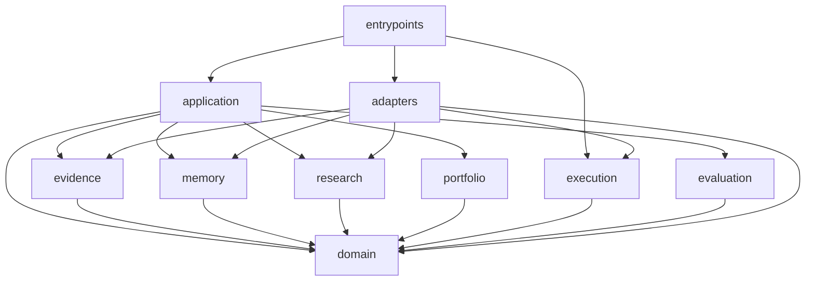

# Module graph

This document owns allowed Python import directions and cross-module interface use. The production
package has executable edges, and `tests/integration/test_module_graph.py` derives the actual graph
and consumed symbols from Python imports. It rejects imports that violate either direction or the
owning module's declared interface. Do not maintain a separate hand-written list of actual edges.

This import gate is the module-structure layer of the
[executable-invariants policy](architecture.md#executable-invariants). It proves dependency
direction, not the semantic correctness or completeness of a module's authority contract.

## Allowed direction

An arrow `a --> b` means module `a` may import the public interface of module `b`. It does not require
the dependency. Prefer passing typed values and ports over adding an edge.

## Rules

- `domain` imports only the Python standard library and other files inside `domain`.
- Capability modules never import `adapters` or `entrypoints`.
- `application` orchestrates public capability APIs; it does not reach into their private stages.
- Adapters implement ports owned by `domain` or the capability they serve. They do not own domain
  policy.
- Entrypoints are the only modules that construct concrete adapters, read credential references, or
  choose a process composition.
- `execution` never imports `research`, a model client, or a Codex adapter.
- `portfolio` consumes validated typed research outcomes and deterministic market/risk inputs; it does
  not invoke a model.
- Research Lab composition may reuse capability code but never imports or writes champion execution
  state.
- A cycle, a reverse edge into adapters, or a new cross-capability edge requires an architecture
  review. Record a durable exception in an ADR.

## Deep-module interfaces

Cross-module callers use lifecycle capabilities and narrow public types rather than research-stage
functions or storage internals. Keep an interface with its owner:

- storage and external implementations depend on the port they implement;
- the framework-free lifecycle kernel owns transition ordering, reconstruction, refusals, conflicts,
  and recovery decisions; persistence adapters validate representations and atomically append its
  selected records;
- application code depends on capability interfaces and result types;
- domain events and identifiers remain free of integration types; and
- composition-specific values stop at the entrypoint.

When a capability needs data owned elsewhere, prefer a typed input or owner-defined port. Add a direct
capability dependency only when the relationship is stable and materially simpler than the port.

A source module used across top-level module boundaries declares its intentional interface in one
static, literal module-level `__all__`. Cross-module production imports name those declared symbols
directly with `from ... import ...`; module-style and wildcard imports cannot prove the consumed
interface and are rejected. A leading underscore remains private even if it is mistakenly listed.
Imports between files under the same top-level module may use implementation details without an
`__all__`, and standard-library or third-party imports are outside this repository interface policy.

Treat `__all__` changes as module-interface changes. Add only contracts justified by an allowed
consumer and the owning architecture; do not export every visible name, add pass-through re-exports,
or imply a supported third-party Python SDK. A change that alters a module seam or caller obligation
also updates this document or the architecture owner as applicable.
